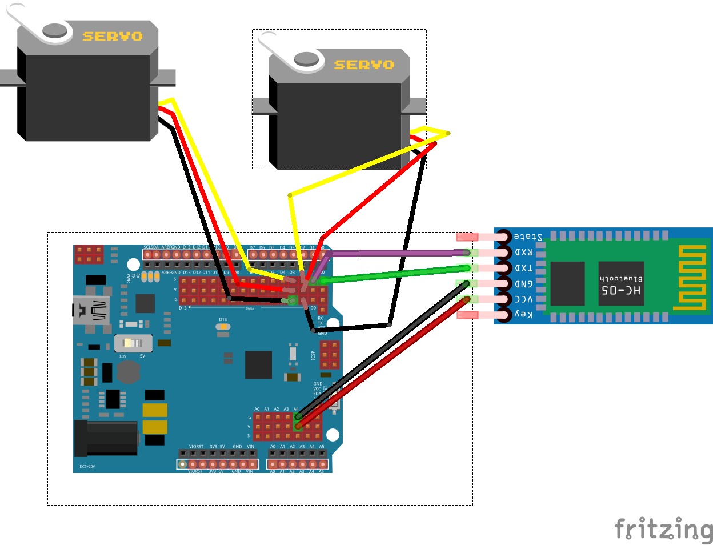

# Dogbot (un [sumobot-jr](https://github.com/makenai/sumobot-jr) pour nodebots day Paris 2015.

Ce repo sers de code de démonstration pour le Dog que vous avez monté.

il représente les commandes les plus simple via 2 interfaces un pad de ps3 ou bien le clavier.

c'est juste une base pour vous lancer, qui permettra de controller le robot de façon basique, a vous de l'améliorer après !

# TL-DR

tu branche les deux servos  comme cela 

```
cp config-sample.js config.js
npm install
npm start
```

# le code

## stand alone 

dans se répertoire se trouve des fichier pour tester le gamepad ```node standAlone/gamepadTest``` le clavier ```node standAlone/keypad``` et le code pour le dogbot ```node standAlone/sumoBase``` en un seul gros fichier consolidé. 

avec ca vous pouvez voir comment manipuler les librairies pour l'input et comment gluer tout ca. 

c'est la version la plus simple du code.

## modulaire 

c'est plus ou moins la meme chose que le sumoBase mais séparé en petit modules et qui utilise le design pattern "Observer" pour communiquer entre eux.

le point d'entrée et index.js a la racine et le code est commenté. 

le fichier que vous avez copié config.js contiens la configuration du robot (chemin du port usb et type de contrôleur)

Les modules keypadMod et gamepadMod émettent des events, que le module sumoMod ecoute et ensuite transmet a l'arduino les instructions pour le moteur

